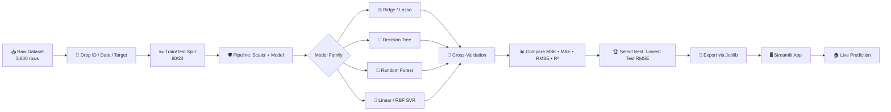
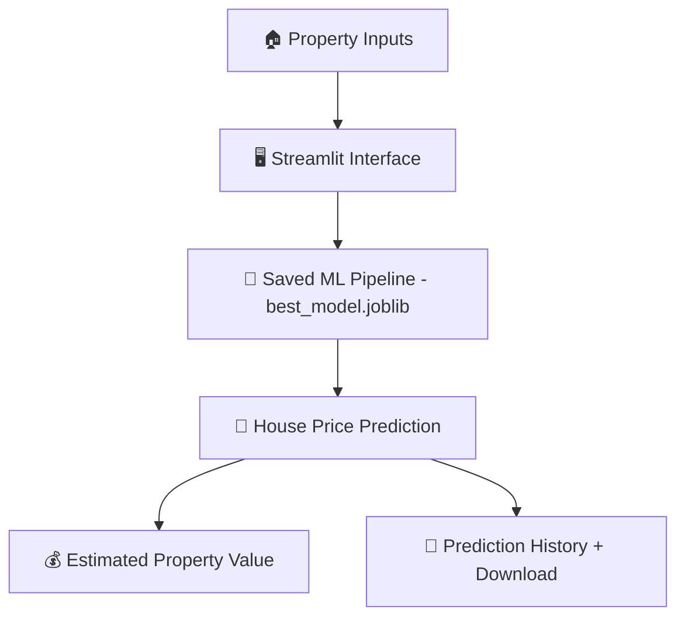

<div align="center">


<br/>

[](https://realestatepriceprediction2130.streamlit.app/)
[](https://www.python.org/)
[](https://scikit-learn.org/)
[](https://streamlit.io/)


</div>

<br/>

<p align="center">
  
</p>

---

## 🧭 Table of Contents

<details open>
<summary>Click to expand</summary>

- [🚀 Live Demo](#-live-demo)
- [📖 Project Overview](#-project-overview)
- [🎯 Objectives](#-objectives)
- [📊 Dataset](#-dataset)
- [🧠 ML Workflow](#-ml-workflow)
- [🛡️ Data Leakage Prevention](#️-data-leakage-prevention)
- [⚖️ Regularization](#️-regularization)
- [🔁 Cross-Validation Strategies](#-cross-validation-strategies)
- [🌳 Decision Tree & Random Forest](#-decision-tree--random-forest)
- [📐 Support Vector Regression](#-support-vector-regression)
- [🏆 Model Performance](#-model-performance)
- [🔍 Diagnostics](#-diagnostics)
- [🖥️ Streamlit Application](#️-streamlit-application)
- [📁 Project Structure](#-project-structure)
- [⚙️ Tech Stack](#️-tech-stack)
- [💻 Installation](#-installation)
- [▶️ Run Locally](#️-run-locally)
- [☁️ Deployment](#️-deployment)
- [🔄 Reproducibility](#-reproducibility)
- [🏭 Production Considerations](#-production-considerations)
- [📚 Concepts Demonstrated](#-concepts-demonstrated)
- [🤝 Contributing](#-contributing)
- [📄 License](#-license)
- [👤 Author](#-author)

</details>

---

## 🚀 Live Demo

<div align="center">

### 🌐 The app is **live** — go predict a house price right now.

<a href="https://realestatepriceprediction2130.streamlit.app/">
  
</a>

**🔗 URL:** [`realestatepriceprediction2130.streamlit.app`](https://realestatepriceprediction2130.streamlit.app/)


</div>

> 💡 **Tip:** Enter area, bedrooms, bathrooms, location score, property age, distance from city, school/metro proximity and crime index — the deployed pipeline returns an instant valuation, and keeps a downloadable prediction history.

---

## 📖 Project Overview

**EstateAI** upgrades a basic, overfit house-price regressor into a **leakage-safe, cross-validated, production-oriented regression system**. It systematically compares linear (Ridge, Lasso), tree-based (Decision Tree, Random Forest) and kernel-based (Linear SVR, RBF SVR) models — then ships the winner through a live **Streamlit** interface.

<table align="center">
<tr>
<td align="center">📦<br/><b>3,800</b><br/>records</td>
<td align="center">🧮<br/><b>9</b><br/>features</td>
<td align="center">🧪<br/><b>4</b><br/>CV strategies</td>
<td align="center">🤖<br/><b>6</b><br/>models compared</td>
<td align="center">🎯<br/><b>93.7%</b><br/>test R² (best model)</td>
</tr>
</table>

---

## 🎯 Objectives

| # | Goal |
|---|------|
| ✅ | Reduce overfitting through regularization |
| ✅ | Apply proper, leakage-safe cross-validation |
| ✅ | Compare linear vs. non-linear regression models |
| ✅ | Control Decision Tree complexity |
| ✅ | Evaluate Random Forest as an ensemble learner |
| ✅ | Compare Linear vs. RBF Support Vector Regression |
| ✅ | Prevent preprocessing leakage using `Pipeline` |
| ✅ | Evaluate with MSE, MAE, RMSE and R² |
| ✅ | Export the winning model with Joblib |
| ✅ | Serve real-time predictions through Streamlit |

---

## 📊 Dataset

<div align="center">

| Property | Value |
|---|---|
| **Records** | 3,800 |
| **Columns** | 12 |
| **Target** | `house_price_inr` |
| **Train / Test Split** | 3,040 / 760 rows (80/20) |
| **Usable Features** | 9 |

</div>

<details>
<summary>📋 <b>Feature Dictionary</b> (click to expand)</summary>

| Feature | Description |
|---|---|
| `area_sqft` | Property area in square feet |
| `bedrooms` | Number of bedrooms |
| `bathrooms` | Number of bathrooms |
| `location_score` | Numerical location quality score |
| `property_age` | Age of the property |
| `distance_city_km` | Distance from city center |
| `near_school` | School proximity indicator |
| `near_metro` | Metro proximity indicator |
| `crime_rate_index` | Local crime-rate index |

**Excluded:** `property_id` (identifier), `sale_date` (retained for Time Series Split only), `house_price_inr` (target).

</details>

```python
X = df.drop(columns=["house_price_inr", "property_id", "sale_date"])
y = df["house_price_inr"]

X_train, X_test, y_train, y_test = train_test_split(
    X, y, test_size=0.2, random_state=42
)
```

---

## 🧠 ML Workflow



---

## 🛡️ Data Leakage Prevention

Scaling happens **inside** a `Pipeline`, so every cross-validation fold learns its own scaling parameters — no information leaks from validation/test data into training.

```python
from sklearn.pipeline import Pipeline
from sklearn.preprocessing import StandardScaler
from sklearn.linear_model import Ridge

ridge_pipeline = Pipeline([
    ("scaler", StandardScaler()),
    ("model", Ridge())
])
```

---

## ⚖️ Regularization

<table align="center">
<tr><th>Model</th><th>Regularization</th><th>Search Space (alpha)</th><th>Selected α</th></tr>
<tr><td><b>Ridge</b></td><td>L2 — shrinks coefficients</td><td>0.001 → 100</td><td align="center"><b>1</b></td></tr>
<tr><td><b>Lasso</b></td><td>L1 — can zero-out coefficients</td><td>0.001 → 100</td><td align="center"><b>100</b></td></tr>
</table>

The selected Lasso model was checked for coefficients shrunk close to zero (automatic feature selection).

---

## 🔁 Cross-Validation Strategies

Four strategies were benchmarked using mean and standard deviation of MSE:

<div align="center">

| Strategy | Purpose |
|---|---|
| 🔀 **K-Fold** (5-fold, shuffled) | Standard robust validation |
| 🎯 **Stratified K-Fold** | Uses target binning for balanced folds |
| 🧮 **Leave-One-Out (LOOCV)** | Exhaustive, maximum-data validation |
| ⏱️ **Time Series Split** | Respects `sale_date` chronology |

</div>

```python
from sklearn.model_selection import KFold
cv = KFold(n_splits=5, shuffle=True, random_state=42)
```

---

## 🌳 Decision Tree & Random Forest

**Decision Tree** — complexity controlled via `max_depth`, `min_samples_split`, `min_samples_leaf` → selected `max_depth=None, min_samples_split=2, min_samples_leaf=10`.

**Random Forest** — 200-tree ensemble (`n_estimators=200`), parallelized with `n_jobs=-1`.

<div align="center">

| Model | Train MSE | Test MSE | Train R² | Test R² |
|---|---|---|---|---|
| 🌳 Decision Tree | ≈ 4.066 × 10¹² | ≈ 7.625 × 10¹² | ≈ 0.9455 | ≈ 0.9053 |
| 🌲 **Random Forest** | ≈ 7.877 × 10¹¹ | ≈ 5.802 × 10¹² | ≈ 0.9894 | **≈ 0.9280** |

</div>

> Random Forest generalized better than the single Decision Tree on this experiment's test split.

---

## 📐 Support Vector Regression

SVR requires scaled features **and** a scaled target (INR values are large), handled via `TransformedTargetRegressor`.

```python
from sklearn.svm import SVR
from sklearn.compose import TransformedTargetRegressor

svr_model = TransformedTargetRegressor(
    regressor=Pipeline([("scaler", StandardScaler()), ("svr", SVR())]),
    transformer=StandardScaler()
)
```

Both **Linear** and **RBF** kernels were grid-searched across `C`, `epsilon`, and (for RBF) `gamma`.

---

## 🏆 Model Performance

<div align="center">

### 🥇 Winner: RBF Support Vector Regression

<table>
<tr><th>Metric</th><th>Result</th></tr>
<tr><td>📉 Test RMSE</td><td><b>≈ ₹22.5 Lakh</b> (₹2,250,000)</td></tr>
<tr><td>📊 Test MAE</td><td><b>≈ ₹16.5 Lakh</b> (₹1,650,000)</td></tr>
<tr><td>🎯 Test R²</td><td><b>≈ 0.937</b> (93.7% variance explained)</td></tr>
</table>

</div>

Six models — **Ridge, Lasso, Decision Tree, Random Forest, Linear SVR, RBF SVR** — were scored identically on MSE, MAE, RMSE and R² inside `results_df`, and ranked by lowest **Test RMSE**. RBF SVR came out on top; the full per-model table is generated at runtime in `notebook.ipynb` / `outputs/final_summary.csv`.

```python
results_df["R² Gap"] = results_df["Train R²"] - results_df["Test R²"]
```

A larger positive gap signals more overfitting — train/test metrics are always read together with the CV results above, never in isolation.

---

## 🔍 Diagnostics

<table align="center">
<tr>
<td align="center" width="50%">

**Actual vs. Predicted**
```python
plt.scatter(y_test, rf_test_pred, alpha=0.6)
plt.plot([y_test.min(), y_test.max()],
         [y_test.min(), y_test.max()], "--")
```
Points hugging the diagonal = accurate predictions.

</td>
<td align="center" width="50%">

**Residual Plot**
```python
residuals = y_test - rf_test_pred
plt.scatter(rf_test_pred, residuals, alpha=0.6)
plt.axhline(y=0, linestyle="--")
```
Random scatter around zero = healthy fit.

</td>
</tr>
</table>

---

## 🖥️ Streamlit Application



The app loads the exported pipeline and serves predictions for all nine features in real time:

```python
import joblib
from pathlib import Path

model = joblib.load(Path("models/best_model.joblib"))
```

---

## 📁 Project Structure

```
SUPARVISED LEARNING/
│
├──Dataset
│     └── Advanced_Regression_HousePrice_Dataset_3800 csv
├── .devcontainer/
│   └── devcontainer.json
│
├── models/
│   ├── best_model.joblib
│   └── model_name.joblib
│
├── outputs/
│   └── final_summary.csv
    └──  Model_Comparison_Using_Test_RMSE_plot.png
    └──SVR_actual_vs_predicted_house_plot.png
    └──cv_comparison.png
    └──final_model_comparision.csv
    └──random_forest_actual_vs_predicted_House_pricesplot.png
    └──random_forest_residual_plot.png
├── app.py
├── notebook
    └── Robust Regression Engine.ipynb
├── requirements.txt
└── README.md
```

---

## ⚙️ Tech Stack

<div align="center">


</div>

---

## 💻 Installation

```bash
git clone https://github.com/your-username/estateai.git
cd estateai
pip install -r requirements.txt
```

**`requirements.txt`**
```
streamlit
pandas
numpy
scikit-learn
joblib
matplotlib
```

---

## ▶️ Run Locally

```bash
python -m streamlit run app.py
```

Then open the URL Streamlit prints (usually `http://localhost:8501`) in your browser.

---

## ☁️ Deployment

<div align="center">

[](https://realestatepriceprediction2130.streamlit.app/)

</div>

Deployed via **Streamlit Community Cloud**, connected directly to this GitHub repository. The repo needs at minimum:

```
app.py
requirements.txt
models/best_model.joblib
```

Streamlit installs `requirements.txt` and loads `models/best_model.joblib` automatically on each deploy.

---

## 🔄 Reproducibility

Every stochastic step uses a fixed seed:

```python
random_state=42
```

Applied consistently across the train/test split, K-Fold, Stratified K-Fold, Decision Tree, and Random Forest.

---

## 🏭 Production Considerations

> ⚠️ **Before using this for real-world property valuation:**

- [ ] Validate on a larger, more representative dataset
- [ ] Keep the final test set isolated from all tuning
- [ ] Monitor prediction error continuously post-deployment
- [ ] Monitor drift in feature distributions
- [ ] Validate inputs and handle outlier property values
- [ ] Retrain when market conditions shift
- [ ] Version datasets and trained models
- [ ] Validate predictions against real transaction prices
- [ ] Evaluate performance across property/location segments
- [ ] Treat every output as an **estimate**, not a guaranteed value

---

## 📚 Concepts Demonstrated

<div align="center">


-4A00E0?style=flat-square)
-00C9FF?style=flat-square)


</div>

---

## 🤝 Contributing

Contributions, issues and feature requests are welcome!

```bash
1. Fork the repo
2. Create your branch:  git checkout -b feature/amazing-feature
3. Commit changes:      git commit -m "Add amazing feature"
4. Push the branch:     git push origin feature/amazing-feature
5. Open a Pull Request
```

---

## 📄 License

This project can be shared under an open-source license of your choice (MIT is a common default for ML portfolio projects). Add a `LICENSE` file to the repo root and update the badge below to match:

```
[](LICENSE)
```

---

## 👤 Author

<div align="center">

**Roshan Marathe**
*Data Analyst | AI/ML Engineer*

[](https://github.com/your-username)
[](https://linkedin.com/in/your-profile)

</div>

---

<div align="center">

### ⭐ If this project helped you, consider giving it a star!


</div>
